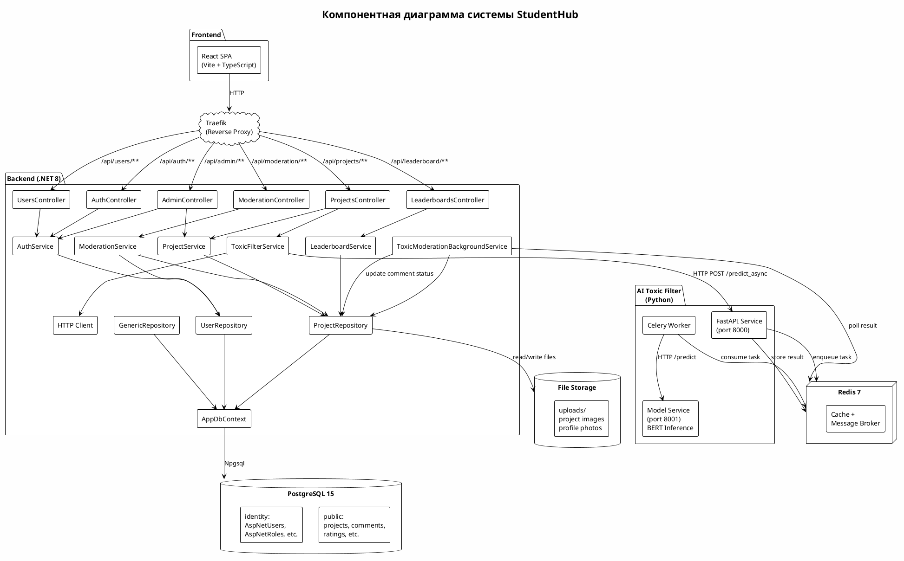

# 4.1.2 Логика работы программы

---

## 1. Общее описание структуры программы

Система **StudentHub** представляет собой веб-приложение для управления студенческими проектами с возможностями социального взаимодействия, экспертного оценивания, AI-модерации контента и формирования рейтингов. Архитектура решения — клиент-серверная, с микросервисной организацией backend-части.

### 1.1 Состав проектов

| Проект | Назначение | Технологии |
|--------|-----------|------------|
| `Frontend/` | SPA-клиент (Single Page Application) | React 19, TypeScript, Vite, styled-components, axios, react-router-dom |
| `Backend/StudentHub.Api/` | ASP.NET Core Web API — точка входа, контроллеры, middleware | .NET 8, C#, Serilog, Swagger/OpenAPI |
| `Backend/StudentHub.Application/` | Библиотека классов — доменные сущности, DTO, сервисы, маппинг | .NET 8, C#, AutoMapper |
| `Backend/StudentHub.Infrastructure/` | Библиотека классов — доступ к данным, внешние сервисы, фоновая обработка | .NET 8, EF Core, Npgsql, HttpClientFactory |
| `comment_filter/` | AI-сервис фильтрации токсичности комментариев | Python FastAPI, Celery, HuggingFace Transformers, Redis |
| `Backend/StudentHub.Tests/` | Модульные тесты backend | xUnit, EF Core InMemory |
| `tests/` | Интеграционные тесты AI-сервиса | Python pytest |

### 1.2 Основные слои приложения

Слои организованы по принципу **Layered Architecture** с инверсией зависимостей (Dependency Inversion):

1. **Controllers** (Backend/StudentHub.Api/Controllers/API/)
   — Обрабатывают HTTP-запросы, выполняют валидацию входных данных, вызывают сервисы, возвращают HTTP-ответы.
   - `AuthController.cs` — аутентификация и авторизация
   - `ProjectsController.cs` — CRUD проектов, комментарии, оценки
   - `UsersController.cs` — профили пользователей
   - `AdminController.cs` — административные функции
   - `LeaderboardsController.cs` — рейтинги
   - `ModerationController.cs` — модерация контента

2. **UseCases / Services** (Backend/StudentHub.Application/Services/)
   — Содержат бизнес-логику приложения. Каждый сервис реализует конкретный сценарий использования.
   - `AuthService.cs` — регистрация, вход, OAuth2
   - `ProjectService.cs` — управление проектами
   - `ToxicFilterService.cs` — AI-фильтрация токсичности
   - `LeaderboardService.cs` — расчёт рейтингов
   - `ModerationService.cs` — модерация комментариев и апелляции

3. **Repositories** (Backend/StudentHub.Infrastructure/Repositories/)
   — Обеспечивают доступ к данным через Entity Framework Core.
   - `GenericRepository.cs` — базовый CRUD
   - `ProjectRepository.cs` — операции с проектами, комментариями, оценками
   - `UserRepository.cs` — операции с пользователями

4. **Domain Entities** (Backend/StudentHub.Application/Entities/)
   — POCO-классы, представляющие объекты предметной области (таблицы БД).
   - User, Project, Attachment, Comment, CommentReport, Appeal
   - Criterion, CriterionScore, Rating, Category, Tag
   - ProjectCategory, ProjectTag (связующие сущности)

5. **Infrastructure** (Backend/StudentHub.Infrastructure/)
   — Реализация технических аспектов: DbContext, миграции, конфигурации EF Core, файловое хранилище, HTTP-клиенты, фоновые службы.
   - `AppDbContext.cs` — основной контекст БД
   - `EntityConfigurations/` — Fluent API конфигурации сущностей
   - `ToxicModerationBackgroundService.cs` — фоновая обработка токсичных комментариев

6. **Frontend Components** (Frontend/src/)
   — React-компоненты, сгруппированные по функциональным модулям.
   - `features/auth/` — аутентификация
   - `features/projects/` — проекты
   - `features/admin/` — администрирование
   - `features/leaderboard/` — рейтинги
   - `features/moderation/` — модерация

7. **AI-модуль** (comment_filter/)
   — Микросервис на Python для определения токсичности текста.
   - `api.py` — FastAPI-сервис (порты 8000/8001)
   - `model_service.py` — инференс BERT-модели
   - `celery_app.py` / `tasks.py` — асинхронная обработка через Celery + Redis

8. **База данных** — PostgreSQL 15.
   - Две схемы: `public` (AppDbContext — проекты, комментарии, оценки, etc.) и `identity` (ApplicationDbContext — пользователи ASP.NET Core Identity)

### 1.3 Взаимодействие между компонентами

```
Traefik (Reverse Proxy)
    │
    ├── Frontend (React SPA на localhost:3000)
    │       └── HTTP к Backend API
    │
    ├── Backend (.NET API на :8080)
    │       ├── PostgreSQL (db:5432) — основное хранилище
    │       ├── Redis (redis:6379) — кэш / брокер сообщений
    │       └── Toxic Filter API (toxic_filter:8000)
    │               ├── Redis (redis:6379) — брокер Celery
    │               └── Model Service (model_service:8001) — BERT inference
    │
    └── Prometheus / Grafana — мониторинг и метрики
```

### 1.4 Последовательность прохождения запроса через систему (на примере создания комментария)

```
1. Пользователь вводит текст комментария → Frontend (React)
2. Frontend отправляет POST /api/projects/{id}/comments → Traefik
3. Traefik направляет запрос → Backend (.NET API)
4. Контроллер ProjectsController.AddComment → валидация модели
5. Вызов ToxicFilterService.CheckCommentToxicityAsync → HTTP POST к Toxic Filter API
6. Toxic Filter API (/predict_async) → Celery задача в Redis
7. Celery worker выполняет инференс BERT-модели (Model Service)
8. Результат возвращается в Backend (токсичен / не токсичен)
9. Комментарий сохраняется в БД с соответствующим статусом
10. Ответ возвращается → Frontend
```

---

## 2. Диаграмма компонентов (PlantUML)



---

## 3. Укрупненный алгоритм работы программы

### 3.1 Общий алгоритм от входа до получения результата

| Шаг | Описание | Используемые классы | Входные данные | Выходные данные |
|-----|----------|---------------------|----------------|-----------------|
| 1 | Пользователь открывает SPA | `Main.tsx`, `App.tsx`, `Header.tsx` | URL приложения | Загруженное React-приложение |
| 2 | Пользователь вводит email/пароль и нажимает «Войти» | `Login.tsx`, `AuthForm.tsx`, `AuthContext.tsx` | Email, Password | JWT cookie |
| 3 | Frontend отправляет POST /api/auth/login | `authService.ts` → `AuthController.Login` | {email, password} | UserDto + cookie |
| 4 | Backend проверяет учётные данные | `AuthService.LoginAsync` → `UserManager.CheckPasswordAsync` | email, password | SignInResult |
| 5 | Backend создаёт cookie-аутентификацию | ASP.NET Core Identity Middleware | ClaimsPrincipal | HttpOnly cookie |
| 6 | Пользователь переходит к списку проектов | `ProjectsList.tsx` | — | GET /api/projects |
| 7 | Backend возвращает проекты (с пагинацией) | `ProjectRepository.GetAllAsync` | page, pageSize | List<ProjectDto> |
| 8 | Пользователь открывает проект | `ProjectDetails.tsx` | projectId | GET /api/projects/{id} |
| 9 | Backend возвращает проект с вложениями и оценками | `ProjectRepository.GetByIdAsync` | projectId | ProjectDto |
| 10 | Пользователь пишет комментарий | `CommentList.tsx` / `CommentForm.tsx` | text | POST /api/projects/{id}/comments |
| 11 | Backend отправляет текст в AI-сервис | `ToxicFilterService.CheckCommentToxicityAsync` | text | статус (toxic/not toxic/pending) |
| 12 | AI-сервис выполняет инференс | `api.py` → `tasks.py` → `model_service.py` | text | prediction + probability |
| 13 | Комментарий сохраняется (если не токсичен) | `ProjectRepository.AddCommentAsync` | Comment entity | CommentDto |
| 14 | Преподаватель выставляет оценку | `ScoreForm.tsx` → `ProjectsController.ScoreProject` | {criterionId, score} | CriterionScoreDto |
| 15 | Backend обновляет рейтинг проекта | `ProjectRepository.AddRatingAsync` | projectId | averageScore |
| 16 | Пользователь просматривает рейтинг | `LeaderboardSection.tsx` | type, period | GET /api/leaderboard |
| 17 | Backend возвращает отсортированные проекты | `LeaderboardService.GetLeaderboardAsync` | type, period | List<LeaderboardDto> |

---

## 4. Анализ объектной модели

### 4.1 Основные сущности предметной области

| Объект | Назначение |
|--------|-----------|
| User | Пользователь системы (студент, преподаватель, администратор) |
| Project | Студенческий проект (курсовая, диплом, лабораторная работа) |
| Attachment | Файл-вложение проекта (изображения, документы) |
| Comment | Комментарий к проекту |
| CommentReport | Жалоба на комментарий |
| Appeal | Апелляция на решение модерации |
| Criterion | Критерий оценивания (устанавливается администратором) |
| CriterionScore | Оценка эксперта по конкретному критерию для проекта |
| Rating | Агрегированный рейтинг проекта (средняя оценка) |
| Category | Категория проекта (например: «Курсовая», «Диплом», «НИР») |
| Tag | Тег проекта (ключевые слова) |
| ProjectCategory | Связь «проект-категория» (многие-ко-многим) |
| ProjectTag | Связь «проект-тег» (многие-ко-многим) |

### 4.2 Детальное описание каждой сущности

---

#### User

**Файл:** `Backend/StudentHub.Application/Entities/User.cs`
**Базовый класс:** `IdentityUser<Guid>` (ASP.NET Core Identity)

**Основные свойства:**

| Свойство | Тип | Назначение |
|----------|-----|-----------|
| Id | Guid (унаследовано) | Уникальный идентификатор |
| UserName | string (унаследовано) | Имя пользователя (логин) |
| Email | string (унаследовано) | Email |
| FullName | string | Полное имя |
| Bio | string? | Биография / описание |
| ProfilePicturePath | string? | Путь к аватарке |
| RefreshToken | string? | Токен обновления (для Moodle OAuth2) |
| RefreshTokenExpiryTime | DateTime? | Срок действия токена обновления |
| RegisterDate | DateTime | Дата регистрации |
| LastLoginDate | DateTime | Дата последнего входа |
| BannedUntil | DateTime? | Дата окончания блокировки |
| MoodleId | string? | Идентификатор в Moodle |
| MoodleToken | string? | Токен доступа к Moodle |

**Основные методы (наследуемые от IdentityUser):**
- `CheckPasswordAsync(UserManager, string)` — проверка пароля
- `GetRolesAsync(RoleManager)` — получение ролей
- `CreateAsync(UserManager, string)` — создание пользователя

**Навигационные свойства:**
- `ICollection<Project> Projects` — проекты пользователя
- `ICollection<Comment> Comments` — комментарии пользователя
- `ICollection<CriterionScore> CriterionScores` — оценки, выставленные пользователем (как экспертом)
- `ICollection<CommentReport> CommentReports` — жалобы, поданные пользователем

**Связи:**
- 1 → ∞ с Project (автор)
- 1 → ∞ с Comment (автор)
- 1 → ∞ с CriterionScore (эксперт)
- 1 → ∞ с CommentReport (репортёр)

---

#### Project

**Файл:** `Backend/StudentHub.Application/Entities/Project.cs`

**Основные свойства:**

| Свойство | Тип | Назначение |
|----------|-----|-----------|
| Id | Guid | Уникальный идентификатор |
| Name | string | Название проекта |
| Description | string | Описание проекта |
| Goal | string? | Цель проекта |
| Stages | string? | Этапы выполнения |
| Result | string? | Результаты |
| Literature | string? | Список литературы |
| Public | bool | Флаг публичности |
| Status | string? | Статус (например, «в работе», «завершён») |
| CreatedAt | DateTime | Дата создания |
| UpdatedAt | DateTime | Дата обновления |
| AuthorId | Guid | FK на User (автор) |

**Методы:** Управляются через `ProjectRepository`:
- `AddAsync(Project)` — создание
- `UpdateAsync(Project)` — обновление
- `DeleteAsync(Project)` — удаление (каскадное: вложения, оценки, комментарии, жалобы)
- `GetByIdAsync(Guid)` — получение с полными Includes (вложения, категории, теги, оценки)

**Навигационные свойства:**
- `User Author` — автор проекта
- `ICollection<Attachment> Attachments` — вложения
- `ICollection<Comment> Comments` — комментарии
- `ICollection<Rating> Ratings` — рейтинги
- `ICollection<ProjectCategory> ProjectCategories` — связь с категориями
- `ICollection<ProjectTag> ProjectTags` — связь с тегами
- `ICollection<CriterionScore> CriterionScores` — экспертные оценки

**Связи:**
- ∞ → 1 с User (автор)
- 1 → ∞ с Attachment, Comment, Rating, CriterionScore
- ∞ → ∞ с Category через ProjectCategory
- ∞ → ∞ с Tag через ProjectTag

---

#### Attachment

**Файл:** `Backend/StudentHub.Application/Entities/Attachment.cs`

**Основные свойства:**

| Свойство | Тип | Назначение |
|----------|-----|-----------|
| Id | Guid | Уникальный идентификатор |
| FileName | string | Имя файла |
| Path | string | Путь к файлу на диске |
| ProjectId | Guid | FK на Project |

**Связи:**
- ∞ → 1 с Project

---

#### Comment

**Файл:** `Backend/StudentHub.Application/Entities/Comment.cs`

**Вложенные перечисления:**

```csharp
public enum CommentModerationStatus { Pending, Approved, Rejected }
public enum CommentModerationOrigin { Manual, Automatic }
public enum CommentAppealStatus { None, Pending, Approved, Rejected }
```

**Основные свойства:**

| Свойство | Тип | Назначение |
|----------|-----|-----------|
| Id | Guid | Уникальный идентификатор |
| Text | string | Текст комментария |
| CreatedAt | DateTime | Дата создания |
| AuthorId | Guid | FK на User (автор) |
| ProjectId | Guid | FK на Project |
| ModerationStatus | CommentModerationStatus | Статус модерации (Pending/Approved/Rejected) |
| ModerationOrigin | CommentModerationOrigin | Источник модерации (Manual/Automatic) |
| AppealStatus | CommentAppealStatus | Статус апелляции (None/Pending/Approved/Rejected) |
| ToxicProbability | double? | Вероятность токсичности (от AI-сервиса) |
| AiTaskId | string? | ID задачи в AI-сервисе (для асинхронного опроса) |

**Связи:**
- ∞ → 1 с User (автор)
- ∞ → 1 с Project
- 1 → ∞ с CommentReport

---

#### CommentReport

**Файл:** `Backend/StudentHub.Application/Entities/CommentReport.cs`

**Основные свойства:**

| Свойство | Тип | Назначение |
|----------|-----|-----------|
| Id | Guid | Уникальный идентификатор |
| Reason | string | Причина жалобы |
| CreatedAt | DateTime | Дата подачи |
| ReporterId | Guid | FK на User (кто подал жалобу) |
| CommentId | Guid | FK на Comment |

**Связи:**
- ∞ → 1 с User (репортёр)
- ∞ → 1 с Comment

---

#### Appeal

**Файл:** `Backend/StudentHub.Application/Entities/Appeal.cs`

**Основные свойства:**

| Свойство | Тип | Назначение |
|----------|-----|-----------|
| Id | Guid | Уникальный идентификатор |
| Reason | string | Текст апелляции |
| Status | AppealStatus (enum) | Статус рассмотрения (Pending / Approved / Rejected) |
| CreatedAt | DateTime | Дата подачи |
| ConsideredAt | DateTime? | Дата рассмотрения |
| CommentId | Guid | FK на Comment |
| UserId | Guid | FK на User (автор апелляции) |

**Связи:**
- ∞ → 1 с Comment
- ∞ → 1 с User

---

#### Criterion

**Файл:** `Backend/StudentHub.Application/Entities/Criterion.cs`

**Основные свойства:**

| Свойство | Тип | Назначение |
|----------|-----|-----------|
| Id | Guid | Уникальный идентификатор |
| Name | string | Название критерия |
| Description | string? | Описание |
| MaxScore | int | Максимальная оценка |
| Weight | double | Вес критерия (для расчёта итоговой оценки) |
| CreatedAt | DateTime | Дата создания |

**Связи:**
- 1 → ∞ с CriterionScore

---

#### CriterionScore

**Файл:** `Backend/StudentHub.Application/Entities/CriterionScore.cs`

**Основные свойства:**

| Свойство | Тип | Назначение |
|----------|-----|-----------|
| Id | Guid | Уникальный идентификатор |
| Score | double | Оценка |
| Comment | string? | Комментарий эксперта |
| TeacherId | Guid | FK на User (эксперт) |
| CriterionId | Guid | FK на Criterion |
| ProjectId | Guid | FK на Project |

**Связи:**
- ∞ → 1 с User (эксперт)
- ∞ → 1 с Criterion
- ∞ → 1 с Project

---

#### Rating

**Файл:** `Backend/StudentHub.Application/Entities/Rating.cs`

**Основные свойства:**

| Свойство | Тип | Назначение |
|----------|-----|-----------|
| Id | Guid | Уникальный идентификатор |
| Score | double | Средняя оценка |
| CreatedAt | DateTime | Дата расчёта |
| ProjectId | Guid | FK на Project |
| UserId | Guid | FK на User (кто выставил) |

**Связи:**
- ∞ → 1 с Project
- ∞ → 1 с User

---

#### Category

**Файл:** `Backend/StudentHub.Application/Entities/Category.cs`

**Основные свойства:**

| Свойство | Тип | Назначение |
|----------|-----|-----------|
| Id | Guid | Уникальный идентификатор |
| Name | string | Название категории |

**Связи:**
- 1 → ∞ с ProjectCategory

---

#### Tag

**Файл:** `Backend/StudentHub.Application/Entities/Tag.cs`

**Основные свойства:**

| Свойство | Тип | Назначение |
|----------|-----|-----------|
| Id | Guid | Уникальный идентификатор |
| Name | string | Название тега |

**Связи:**
- 1 → ∞ с ProjectTag

---

#### ProjectCategory и ProjectTag

**Файлы:** `ProjectCategory.cs`, `ProjectTag.cs`

Связующие сущности для реализации отношения «многие-ко-многим» между Project ↔ Category и Project ↔ Tag.

**ProjectCategory:**
| Свойство | Тип |
|----------|-----|
| ProjectId | Guid (FK + составной PK) |
| CategoryId | Guid (FK + составной PK) |

**ProjectTag:**
| Свойство | Тип |
|----------|-----|
| ProjectId | Guid (FK + составной PK) |
| TagId | Guid (FK + составной PK) |

---

## 6. Логика работы каждого модуля

---

### 6.1 Модуль аутентификации

#### Текстовое описание логики

**Инициатор процесса:** Пользователь, открывающий приложение или нажимающий «Войти» / «Зарегистрироваться».

**Участвующие классы:**
- `AuthController` (`Backend/StudentHub.Api/Controllers/API/AuthController.cs`)
- `AuthService` (`Backend/StudentHub.Application/Services/AuthService.cs`)
- `UserRepository` (`Backend/StudentHub.Infrastructure/Repositories/UserRepository.cs`)
- `SignInManager<IdentityUser<Guid>>` (ASP.NET Core Identity)
- `UserManager<IdentityUser<Guid>>` (ASP.NET Core Identity)
- `AuthContext` (`Frontend/src/features/auth/context/AuthContext.tsx`)
- `authService.ts` (`Frontend/src/features/auth/services/authService.ts`)
- `AuthForm.tsx` (`Frontend/src/features/auth/components/AuthForm.tsx`)

**Сценарий «Регистрация»:**

1. Пользователь заполняет форму регистрации (Username, Email, Password, FullName) на странице `Registration.tsx`.
2. Frontend отправляет POST-запрос `/api/auth/register` через `authService.ts` → метод `register()`.
3. `AuthController.Register()` принимает `RegisterDto { Username, Email, Password, FullName }`.
4. Контроллер вызывает `AuthService.RegisterAsync(dto)`.
5. `AuthService.RegisterAsync()`:
   - Проверяет, не занят ли Username и Email (через `UserManager.FindByNameAsync` / `FindByEmailAsync`).
   - Создаёт объект `User` через `UserManager.CreateAsync(user, password)`.
   - Назначает роль «User» через `UserManager.AddToRoleAsync(user, "User")`.
   - Выполняет вход через `SignInManager.SignInAsync(user, isPersistent: false)`.
6. Возвращается `UserDto { Id, Username, FullName, Email, Roles }` + cookie-аутентификация.
7. Frontend сохраняет пользователя в `AuthContext` и перенаправляет на главную.

**Сценарий «Вход»:**

1. Пользователь вводит Username/Email и Password на странице `Login.tsx`.
2. Frontend отправляет POST `/api/auth/login` через `authService.login()`.
3. `AuthController.Login()` принимает `LoginDto { UsernameOrEmail, Password }`.
4. Контроллер вызывает `AuthService.LoginAsync(dto)`.
5. `AuthService.LoginAsync()`:
   - Находит пользователя по Username или Email через `UserManager.FindByNameAsync` / `FindByEmailAsync`.
   - Проверяет блокировку: если `BannedUntil > DateTime.UtcNow` — возвращает ошибку.
   - Проверяет пароль через `UserManager.CheckPasswordAsync(user, password)`.
   - Выполняет вход через `SignInManager.SignInAsync(user, isPersistent: false)`.
   - Обновляет `LastLoginDate`.
6. Возвращается `UserDto` + cookie.
7. Frontend обновляет `AuthContext` и перенаправляет на главную.

**Сценарий «Выход»:**

1. Пользователь нажимает «Выйти» в `Header.tsx`.
2. `AuthContext.logout()` вызывает `authService.logout()` → POST `/api/auth/logout`.
3. `AuthController.Logout()` вызывает `SignInManager.SignOutAsync()`.
4. Cookie удаляется, `AuthContext` очищается.

**Сценарий «Moodle OAuth2»:**

1. Пользователь нажимает «Войти через Moodle» в `AuthForm.tsx`.
2. Frontend перенаправляется на `/api/auth/challenge?provider=Moodle`.
3. `AuthController.Challenge()` создаёт `AuthenticationProperties` с `RedirectUri` на `/api/auth/callback?provider=Moodle` и вызывает `Challenge(properties, provider)`.
4. Пользователь перенаправляется на сервер Moodle для авторизации.
5. После успешной авторизации Moodle перенаправляет обратно на `/api/auth/callback?provider=Moodle`.
6. `AuthController.Callback()` получает `AuthenticateResult` от внешнего провайдера.
7. Вызывает `AuthService.GetOrCreateUserFromMoodleAsync(principal)`:
   - Извлекает `MoodleId` из claims.
   - Ищет существующего пользователя по `MoodleId` через `UserRepository.GetByMoodleIdAsync()`.
   - Если не найден — создаёт нового пользователя с данными из Moodle.
   - Выполняет вход через `SignInManager.SignInAsync()`.
8. Перенаправляет на `/` на фронтенде.

**Результат:** Пользователь авторизован, cookie установлена, `AuthContext` содержит данные пользователя.

#### Рекомендуемые листинги

| Листинг | Файл | Назначение |
|---------|------|-----------|
| 1 | `Backend/StudentHub.Api/Controllers/API/AuthController.cs` | Демонстрирует API-контроллер аутентификации: эндпоинты Register, Login, Logout, GetMe, OAuth2 |
| 2 | `Backend/StudentHub.Application/Services/AuthService.cs` → метод `RegisterAsync()` | Показывает бизнес-логику регистрации: проверка дубликатов, создание IdentityUser, назначение роли |
| 3 | `Backend/StudentHub.Application/Services/AuthService.cs` → метод `GetOrCreateUserFromMoodleAsync()` | Демонстрирует интеграцию с внешним OAuth2-провайдером (Moodle) |
| 4 | `Frontend/src/features/auth/services/authService.ts` | Показывает клиентскую логику вызова API аутентификации |
| 5 | `Frontend/src/features/auth/context/AuthContext.tsx` | Демонстрирует управление состоянием аутентификации на фронтенде |
| 6 | `Frontend/src/features/auth/components/AuthForm.tsx` | Показывает UI-логику формы входа/регистрации |

---

### 6.2 Модуль управления проектами

#### Текстовое описание логики

**Инициатор процесса:** Пользователь (авторизованный студент) через интерфейс управления проектами.

**Участвующие классы:**
- `ProjectsController` (`Backend/StudentHub.Api/Controllers/API/ProjectsController.cs`)
- `ProjectService` (`Backend/StudentHub.Application/Services/ProjectService.cs`)
- `ProjectRepository` (`Backend/StudentHub.Infrastructure/Repositories/ProjectRepository.cs`)
- `UserRepository` (`Backend/StudentHub.Infrastructure/Repositories/UserRepository.cs`)
- `AppDbContext` (`Backend/StudentHub.Infrastructure/AppDbContext.cs`)
- Фронтенд: `ProjectForm.tsx`, `ProjectDetails.tsx`, `ProjectsList.tsx`, `projectsService.ts`

**Сценарий «Создание проекта»:**

1. Пользователь нажимает «Создать проект» на странице `ProjectForm.tsx`.
2. Frontend отправляет POST `/api/projects` с `CreateProjectDto { Name, Description, Goal, Stages, Result, Literature, Public, Status, CategoryIds, TagIds, Images }`.
3. `ProjectsController.CreateAsync(CreateProjectDto)`:
   - Извлекает текущего пользователя из `HttpContext.User` через `UserManager.GetUserAsync()`.
   - Проверяет, авторизован ли пользователь (иначе 401).
   - Вызывает `ProjectService.CreateProjectAsync(dto, user.Id)`.
4. `ProjectService.CreateProjectAsync(dto, authorId)`:
   - Создаёт объект `Project` и заполняет его полями из DTO.
   - Устанавливает `AuthorId = authorId`, `CreatedAt = DateTime.UtcNow`, `UpdatedAt = DateTime.UtcNow`.
   - Вызывает `ProjectRepository.AddAsync(project)`.
   - Если переданы `CategoryIds`, создаёт `ProjectCategory` для каждой категории.
   - Если переданы `TagIds`, создаёт `ProjectTag` для каждого тега.
   - Для каждого изображения создаёт `Attachment`, сохраняет файл в `wwwroot/uploads/`.
5. Проект сохраняется в БД.
6. Возвращается `ProjectDto` с Id созданного проекта.
7. Frontend перенаправляет на страницу проекта.

**Сценарий «Просмотр списка проектов»:**

1. Пользователь открывает страницу `ProjectsList.tsx`.
2. Frontend отправляет GET `/api/projects?page=1&pageSize=10&search=&sortBy=date`.
3. `ProjectsController.GetAll([FromQuery] int page, int pageSize, string? search, string? sortBy)`:
   - Вызывает `ProjectRepository.GetAllAsync(page, pageSize)` или `ProjectRepository.SearchProjectsAsync(search, page, pageSize)`.
4. `ProjectRepository.GetAllAsync()`:
   - Выполняет LINQ-запрос с пагинацией `.Skip((page - 1) * pageSize).Take(pageSize)`.
   - Включает навигационные свойства: `.Include(p => p.Attachments).Include(p => p.Author).Include(p => p.ProjectCategories).ThenInclude(pc => pc.Category).Include(p => p.ProjectTags).ThenInclude(pt => pt.Tag)`.
   - Возвращает `List<Project>`.
5. Результат маппится в `List<ProjectCardDto>` через AutoMapper.
6. Frontend отображает список карточек проектов.

**Сценарий «Редактирование проекта»:**

1. Пользователь нажимает «Редактировать» на странице `ProjectDetails.tsx`.
2. Frontend отправляет PUT `/api/projects/{id}` с `UpdateProjectDto`.
3. `ProjectsController.UpdateAsync(Guid id, UpdateProjectDto dto)`:
   - Проверяет, что пользователь — автор проекта (иначе 403).
   - Вызывает `ProjectService.UpdateProjectAsync(id, dto)`.
4. `ProjectService.UpdateProjectAsync(id, dto)`:
   - Загружает проект через `ProjectRepository.GetByIdAsync(id)`.
   - Обновляет поля из DTO.
   - Обновляет связи с категориями и тегами (удаляет старые, добавляет новые).
   - Вызывает `ProjectRepository.UpdateAsync(project)` → `SaveChangesAsync()`.
5. Возвращается обновлённый `ProjectDto`.

**Сценарий «Удаление проекта»:**

1. Пользователь нажимает «Удалить» (только автор или администратор).
2. Frontend отправляет DELETE `/api/projects/{id}`.
3. `ProjectsController.DeleteAsync(Guid id)`:
   - Проверяет права: автор или администратор.
   - Вызывает `ProjectService.DeleteProjectAsync(id)`.
4. `ProjectService.DeleteProjectAsync(id)`:
   - Загружает проект.
   - Удаляет прикреплённые файлы с диска.
   - Вызывает `ProjectRepository.DeleteAsync(project)`.
   - `ProjectRepository.DeleteAsync()` выполняет каскадное удаление: вложения → комментарии → жалобы → оценки → рейтинги → связи.
5. Возвращается `204 No Content`.

**Результат:** Проект создан/отредактирован/удалён в БД, пользователь видит актуальный список проектов.

#### Рекомендуемые листинги

| Листинг | Файл | Назначение |
|---------|------|-----------|
| 7 | `Backend/StudentHub.Api/Controllers/API/ProjectsController.cs` | Демонстрирует полный CRUD-контроллер для проектов |
| 8 | `Backend/StudentHub.Application/Services/ProjectService.cs` → метод `CreateProjectAsync()` | Показывает бизнес-логику создания проекта |
| 9 | `Backend/StudentHub.Infrastructure/Repositories/ProjectRepository.cs` → метод `GetAllAsync()` | Демонстрирует пагинированный запрос с Includes и проекцией |
| 10 | `Backend/StudentHub.Infrastructure/Repositories/ProjectRepository.cs` → метод `DeleteAsync()` | Показывает каскадное удаление связанных сущностей |
| 11 | `Frontend/src/features/projects/services/projectsService.ts` | Клиентская логика CRUD проектов |
| 12 | `Frontend/src/features/projects/pages/ProjectForm.tsx` | UI-форма создания/редактирования с загрузкой изображений |

---

### 6.3 Модуль комментариев

#### Текстовое описание логики

**Инициатор процесса:** Пользователь, просматривающий проект и желающий оставить комментарий.

**Участвующие классы:**
- `ProjectsController.AddComment()` (`Backend/StudentHub.Api/Controllers/API/ProjectsController.cs`)
- `ToxicFilterService` (`Backend/StudentHub.Application/Services/ToxicFilterService.cs`)
- `ProjectRepository.AddCommentAsync()` (`Backend/StudentHub.Infrastructure/Repositories/ProjectRepository.cs`)
- `ToxicModerationBackgroundService` (`Backend/StudentHub.Infrastructure/Services/ToxicModerationBackgroundService.cs`)
- `api.py`, `celery_app.py`, `model_service.py` (comment_filter/)
- `CommentReport` entity
- Фронтенд: `CommentList.tsx`, `CommentForm.tsx`, `projectsService.ts`

**Сценарий «Добавление комментария»:**

1. Пользователь вводит текст комментария на странице `ProjectDetails.tsx` → `CommentForm.tsx`.
2. Frontend отправляет POST `/api/projects/{projectId}/comments` с `{ text: string }`.
3. `ProjectsController.AddComment(Guid projectId, [FromBody] string text)`:
   - Проверяет авторизацию пользователя.
   - Вызывает `ToxicFilterService.CheckCommentToxicityAsync(text)`.
4. `ToxicFilterService.CheckCommentToxicityAsync(string text)`:
   - Отправляет HTTP POST на `http://toxic_filter:8000/predict_async` или `http://toxic_filter:8000/predict` (синхронный режим) с телом `{ "text": text }`.
   - В синхронном режиме (эндпоинт `/predict`):
     - Получает ответ: `{ "prediction": "toxic" | "not toxic", "toxic_probability": 0.95 }`.
     - Возвращает `(bool isToxic, double probability)`.
   - В асинхронном режиме (эндпоинт `/predict_async`):
     - Получает `{ "task_id": "uuid", "status": "pending" }`.
     - Возвращает результат с `status = pending`, сохраняет `task_id`.
5. Алгоритм модерации в `ProjectsController.AddComment()`:
   - **Если AI вернул `isToxic = true`:** комментарий сохраняется со статусом `ModerationStatus = Pending`, `ModerationOrigin = Automatic`. Устанавливается `ToxicProbability`.
   - **Если AI вернул `isToxic = false`:** комментарий сохраняется со статусом `ModerationStatus = Approved`, `ModerationOrigin = Automatic`.
   - **Если AI вернул `status = pending`:** комментарий сохраняется со статусом `ModerationStatus = Pending`, сохраняется `AiTaskId` для последующего опроса.
6. `ProjectRepository.AddCommentAsync(Comment)`:
   - Создаёт объект `Comment { Text, AuthorId, ProjectId, CreatedAt, ModerationStatus, ModerationOrigin, ToxicProbability, AiTaskId }`.
   - Добавляет в `DbSet<Comment>` и вызывает `SaveChangesAsync()`.
   - Возвращает созданный `Comment`.
7. Возвращается `CommentDto { Id, Text, AuthorName, CreatedAt, ModerationStatus }`.
8. **Фоновая обработка асинхронных результатов** (если статус pending):
   - `ToxicModerationBackgroundService` (BackgroundService) периодически (каждые ~10-30 секунд) опрашивает AI-сервис через `GET /task_result/{task_id}`.
   - Если задача завершена, обновляет `ModerationStatus` и `ToxicProbability` комментария.
   - Если комментарий признан токсичным, статус меняется на `Pending` (ожидает ручной модерации).

**Сценарий «Жалоба на комментарий»:**

1. Пользователь нажимает «Пожаловаться» на комментарии в `CommentList.tsx`.
2. Frontend отправляет POST `/api/projects/{projectId}/comments/{commentId}/report` с `{ reason: string }`.
3. `ProjectsController.ReportComment(Guid projectId, Guid commentId, [FromBody] string reason)`:
   - Проверяет авторизацию.
   - Вызывает `ProjectRepository.AddCommentReportAsync(commentId, report)`.
4. `ProjectRepository.AddCommentReportAsync()`:
   - Проверяет, не подавал ли уже этот пользователь жалобу на этот комментарий (защита от дубликатов).
   - Создаёт `CommentReport { CommentId, ReporterId, Reason, CreatedAt }`.
   - Сохраняет в БД.
5. Возвращается статус жалобы.

**Результат:** Комментарий сохранён с учётом AI-модерации, проходит проверку на токсичность. При жалобе — создаётся запись для модератора.

#### Рекомендуемые листинги

| Листинг | Файл | Назначение |
|---------|------|-----------|
| 13 | `Backend/StudentHub.Api/Controllers/API/ProjectsController.cs` → метод `AddComment()` | Показывает полный цикл: приём запроса → AI-фильтрация → сохранение |
| 14 | `Backend/StudentHub.Application/Services/ToxicFilterService.cs` → метод `CheckCommentToxicityAsync()` | Демонстрирует HTTP-взаимодействие с AI-сервисом |
| 15 | `Backend/StudentHub.Infrastructure/Services/ToxicModerationBackgroundService.cs` | Показывает фоновую обработку асинхронных результатов токсичности |
| 16 | `Backend/StudentHub.Infrastructure/Repositories/ProjectRepository.cs` → метод `AddCommentAsync()` | Сохранение комментария с отслеживанием статуса модерации |
| 17 | `comment_filter/api.py` | FastAPI-сервис для AI-модерации (точка входа) |
| 18 | `comment_filter/tasks.py` | Celery-задачи асинхронной фильтрации |
| 19 | `comment_filter/model_service.py` | Инференс BERT-модели для определения токсичности |
| 20 | `Frontend/src/features/projects/components/CommentList.tsx` | UI-компонент списка комментариев с отображением статусов |

---

### 6.4 Модуль экспертного оценивания

#### Текстовое описание логики

**Инициатор процесса:** Преподаватель (пользователь с ролью Teacher), просматривающий проект студента.

**Участвующие классы:**
- `ProjectsController.ScoreProject()` (`Backend/StudentHub.Api/Controllers/API/ProjectsController.cs`)
- `ProjectRepository` (`Backend/StudentHub.Infrastructure/Repositories/ProjectRepository.cs`)
- `Criterion` (`Backend/StudentHub.Application/Entities/Criterion.cs`)
- `CriterionScore` (`Backend/StudentHub.Application/Entities/CriterionScore.cs`)
- `Rating` (`Backend/StudentHub.Application/Entities/Rating.cs`)
- Фронтенд: `ScoreForm.tsx`, `projectsService.ts`

**Сценарий «Выставление оценки»:**

1. Преподаватель открывает страницу проекта и нажимает «Оценить».
2. Frontend загружает список критериев: GET `/api/projects/{projectId}/scores`.
3. `ProjectsController.GetScores(Guid projectId)` возвращает список `CriterionDto` с текущими оценками (если есть).
4. Преподаватель заполняет форму `ScoreForm.tsx`: для каждого критерия вводит оценку и, опционально, комментарий.
5. Frontend отправляет POST `/api/projects/{projectId}/score` с `CreateScoresDto { Scores: [{ CriterionId, Score, Comment }] }`.
6. `ProjectsController.ScoreProject(Guid projectId, CreateScoresDto dto)`:
   - Извлекает текущего пользователя (преподавателя).
   - Проверяет, что пользователь имеет роль Teacher (через `UserManager.IsInRoleAsync(user, "Teacher")`).
   - Вызывает `ProjectRepository.AddScoresAsync(projectId, teacherId, scores)`.
7. `ProjectRepository.AddScoresAsync(projectId, teacherId, scores)`:
   - Для каждого критерия:
     - Проверяет, не превышает ли Score `Criterion.MaxScore`.
     - Создаёт или обновляет `CriterionScore { TeacherId, CriterionId, ProjectId, Score, Comment }`.
   - Вызывает `ProjectRepository.AddRatingAsync(projectId)`.
8. `ProjectRepository.AddRatingAsync(projectId)`:
   - Вычисляет среднюю оценку проекта по всем `CriterionScore`.
   - Создаёт или обновляет `Rating { ProjectId, Score = average, CreatedAt }`.
   - Возвращает `averageScore`.
9. Возвращается `{ Scores: List<CriterionScoreDto>, AverageScore: double }`.
10. Фронтенд обновляет отображение рейтинга проекта.

**Результат:** Оценки сохранены в БД, средний рейтинг проекта пересчитан и отображается на странице.

#### Рекомендуемые листинги

| Листинг | Файл | Назначение |
|---------|------|-----------|
| 21 | `Backend/StudentHub.Api/Controllers/API/ProjectsController.cs` → методы `ScoreProject()`, `GetScores()` | Демонстрирует API оценивания с проверкой роли Teacher |
| 22 | `Backend/StudentHub.Infrastructure/Repositories/ProjectRepository.cs` → метод `AddRatingAsync()` | Показывает логику расчёта средней оценки и создания рейтинга |
| 23 | `Backend/StudentHub.Application/Entities/CriterionScore.cs` | Сущность «оценка по критерию» |
| 24 | `Frontend/src/features/projects/components/ScoreForm.tsx` | UI-форма выставления оценок по критериям |

---

### 6.5 Модуль рейтингов (Leaderboard)

#### Текстовое описание логики

**Инициатор процесса:** Любой пользователь, открывающий страницу «Рейтинги» / «Leaderboard».

**Участвующие классы:**
- `LeaderboardsController` (`Backend/StudentHub.Api/Controllers/API/LeaderboardsController.cs`)
- `LeaderboardService` (`Backend/StudentHub.Application/Services/LeaderboardService.cs`)
- `ProjectRepository` (методы `GetAllAsync`, `GetAverageRatingAsync`)
- Фронтенд: `LeaderboardSection.tsx`, `leaderboardService.ts`

**Сценарий «Просмотр рейтинга»:**

1. Пользователь открывает страницу `/leaderboard`.
2. Frontend отправляет GET `/api/leaderboard?type=average&period=all`.
3. `LeaderboardsController.GetLeaderboard(string? type, string? period)`:
   - Вызывает `LeaderboardService.GetLeaderboardAsync(type, period)`.
4. `LeaderboardService.GetLeaderboardAsync(type, period)`:
   - Загружает все проекты (или отфильтрованные по периоду) через `ProjectRepository.GetAllAsync()`.
   - Для каждого проекта вычисляет среднюю оценку (или использует существующий `Rating`).
   - Сортирует проекты по убыванию средней оценки.
   - Возвращает `List<LeaderboardDto { ProjectId, ProjectName, AuthorName, AverageScore, RatingCount }>`.
5. Возвращается отсортированный список.
6. Frontend отображает таблицу рейтинга в `LeaderboardSection.tsx`.

**Результат:** Пользователь видит таблицу лидеров с проектами, отсортированными по рейтингу.

#### Рекомендуемые листинги

| Листинг | Файл | Назначение |
|---------|------|-----------|
| 25 | `Backend/StudentHub.Api/Controllers/API/LeaderboardsController.cs` | Контроллер рейтингов |
| 26 | `Backend/StudentHub.Application/Services/LeaderboardService.cs` → метод `GetLeaderboardAsync()` | Бизнес-логика расчёта и сортировки рейтинга |
| 27 | `Frontend/src/features/leaderboard/components/LeaderboardSection.tsx` | UI-компонент таблицы рейтинга |
| 28 | `Frontend/src/features/leaderboard/services/leaderboardService.ts` | Клиентский сервис рейтингов |

---

### 6.6 Модуль модерации контента

#### Текстовое описание логики

**Инициатор процесса:** 
1. Автоматически — при добавлении нового комментария (AI-модерация).
2. Вручную — модератор (Teacher/Admin) открывает страницу модерации.

**Участвующие классы:**
- AI-модерация: `ToxicFilterService`, `ToxicModerationBackgroundService`, `comment_filter` (api.py, celery, model_service)
- Ручная модерация: `ModerationController` (`Backend/StudentHub.Api/Controllers/API/ModerationController.cs`)
- `ModerationService` (`Backend/StudentHub.Application/Services/ModerationService.cs`)
- `ProjectRepository` (методы: `GetCommentsByProjectIdAsync`, `GetReportedCommentsAsync`, `GetAppealByCommentIdAsync`, `AddCommentReportAsync`)
- `UserRepository`
- Фронтенд: `ModerationPage.tsx`, `moderationService.ts`

**Сценарий «AI-модерация (автоматическая)»:**

1. При добавлении комментария (см. раздел 6.3) текст отправляется в `ToxicFilterService.CheckCommentToxicityAsync()`.
2. `ToxicFilterService` отправляет HTTP POST на `toxic_filter:8000/predict_async`.
3. FastAPI (`api.py`):
   - Синхронно: вызывает `model_service:8001/predict` (BERT) → возвращает результат.
   - Асинхронно: создаёт Celery-задачу `tasks.toxic_task` → возвращает `task_id`.
4. Celery worker выполняет `toxic_task`:
   - Отправляет текст в `model_service:8001/predict`.
   - Получает `{ "prediction": "toxic"|"not toxic", "toxic_probability": float }`.
   - Сохраняет результат в Redis (Celery result backend).
5. Backend получает результат (синхронно сразу, асинхронно — через `ToxicModerationBackgroundService`).
6. В зависимости от результата:
   - **not toxic** → `ModerationStatus = Approved`, комментарий виден всем.
   - **toxic** → `ModerationStatus = Pending`, комментарий скрыт, требует ручной модерации.
   - **в случае ошибки** → `ModerationStatus = Pending`, комментарий отправлен на ручную модерацию.

**Сценарий «Ручная модерация»:**

1. Модератор открывает страницу `/moderation` (`ModerationPage.tsx`).
2. Frontend отправляет GET `/api/moderation/pending`.
3. `ModerationController.GetPendingComments()`:
   - Проверяет роль модератора (Teacher или Admin).
   - Вызывает `ProjectRepository.GetCommentsByProjectIdAsync(null, onlyApproved: false)`.
   - Фильтрует комментарии со статусом `Pending`.
4. Также загружаются «пожалованные» комментарии: GET `/api/moderation/reported`.
5. `ModerationController.GetReportedComments()`:
   - Вызывает `ProjectRepository.GetReportedCommentsAsync()`.
   - Возвращает комментарии, на которые поступили жалобы, отсортированные по количеству жалоб.
6. Модератор рассматривает комментарий и принимает решение:
   - **Approve** → POST `/api/moderation/approve/{commentId}`.
     - `ModerationController.ApproveComment(Guid commentId)`:
       - Изменяет `ModerationStatus = Approved`.
       - Сохраняет в БД.
   - **Reject** → POST `/api/moderation/reject/{commentId}`.
     - `ModerationController.RejectComment(Guid commentId)`:
       - Изменяет `ModerationStatus = Rejected`.
       - Сохраняет в БД.
   - **Заблокировать автора** → POST `/api/moderation/mute/{userId}` с `MuteDto { Days }`.
     - `ModerationController.MuteUser(Guid userId, MuteDto dto)`:
       - Устанавливает `User.BannedUntil = DateTime.UtcNow.AddDays(dto.Days)`.
       - Сохраняет в БД.

**Сценарий «Апелляция»:**

1. Пользователь, чей комментарий был отклонён, нажимает «Подать апелляцию».
2. Frontend отправляет POST `/api/moderation/{commentId}/appeal` с `{ reason: string }`.
3. `ModerationController.SubmitAppeal(Guid commentId, [FromBody] string reason)`:
   - Создаёт `Appeal { CommentId, UserId, Reason, Status = Pending, CreatedAt }`.
   - Изменяет `Comment.AppealStatus = Pending`.
4. Модератор рассматривает апелляцию:
   - **Approve** → POST `/api/moderation/appeal/{appealId}/approve`:
     - `Appeal.Status = Approved`, `Comment.AppealStatus = Approved`, `Comment.ModerationStatus = Approved`.
   - **Reject** → POST `/api/moderation/appeal/{appealId}/reject`:
     - `Appeal.Status = Rejected`, `Comment.AppealStatus = Rejected`.

**Результат:** Токсичные комментарии автоматически блокируются, модератор может принять окончательное решение, пользователь может подать апелляцию.

#### Рекомендуемые листинги

| Листинг | Файл | Назначение |
|---------|------|-----------|
| 29 | `Backend/StudentHub.Api/Controllers/API/ModerationController.cs` | Контроллер модерации — получение pending/жалоб, approve/reject, апелляции, блокировка |
| 30 | `Backend/StudentHub.Application/Services/ToxicFilterService.cs` | HTTP-клиент для AI-сервиса фильтрации |
| 31 | `Backend/StudentHub.Infrastructure/Services/ToxicModerationBackgroundService.cs` | Фоновая служба опроса асинхронных задач модерации |
| 32 | `comment_filter/api.py` | FastAPI-сервис AI-модерации (синхронный и асинхронный режимы) |
| 33 | `comment_filter/model_service.py` | Модель BERT для определения токсичности |
| 34 | `comment_filter/tasks.py` | Celery-задачи для async-модерации |
| 35 | `Backend/StudentHub.Infrastructure/Repositories/ProjectRepository.cs` → метод `GetReportedCommentsAsync()` | Получение списка пожалованных комментариев с сортировкой |
| 36 | `Frontend/src/features/moderation/pages/ModerationPage.tsx` | UI-страница модерации |
| 37 | `Frontend/src/features/moderation/services/moderationService.ts` | Клиентский сервис модерации |

---

### 6.7 Модуль администрирования

#### Текстовое описание логики

**Инициатор процесса:** Пользователь с ролью Admin.

**Участвующие классы:**
- `AdminController` (`Backend/StudentHub.Api/Controllers/API/AdminController.cs`)
- `AuthService` (`Backend/StudentHub.Application/Services/AuthService.cs`)
- `ProjectService` (`Backend/StudentHub.Application/Services/ProjectService.cs`)
- `UserRepository` (`Backend/StudentHub.Infrastructure/Repositories/UserRepository.cs`)
- `ProjectRepository` (`Backend/StudentHub.Infrastructure/Repositories/ProjectRepository.cs`)
- Фронтенд: `WebAdmin.tsx`, `adminService.ts`

**Сценарий «Управление пользователями»:**

1. Администратор открывает страницу `/admin` (`WebAdmin.tsx`).
2. Загружается список пользователей: GET `/api/admin/users`.
3. `AdminController.GetUsers()`:
   - Проверяет роль Admin (атрибут `[Authorize(Roles = "Admin")]`).
   - Вызывает `UserRepository.GetAllAsync()`.
   - Возвращает `List<UserDto>` с ролями.
4. Администратор может:
   - **Заблокировать пользователя:** PUT `/api/admin/users/{userId}/ban` с `BanDto { Days }`.
     - `AdminController.BanUser(Guid userId, BanDto dto)`:
       - Устанавливает `User.BannedUntil = DateTime.UtcNow.AddDays(dto.Days)`.
   - **Разблокировать:** DELETE `/api/admin/users/{userId}/ban`.
     - `AdminController.UnbanUser(Guid userId)`:
       - Устанавливает `User.BannedUntil = null`.
   - **Изменить роль:** PUT `/api/admin/users/{userId}/role` с `{ role: string }`.
     - `AdminController.ChangeUserRole(Guid userId, [FromBody] string role)`:
       - Удаляет текущие роли пользователя.
       - Назначает новую роль через `UserManager.AddToRoleAsync()`.
   - **Удалить пользователя (и все его данные):** DELETE `/api/admin/users/{userId}`.
     - `AdminController.DeleteUser(Guid userId)`:
       - Удаляет пользователя и связанные данные (проекты, комментарии, etc.).
   - **Удалить проект:** DELETE `/api/admin/projects/{projectId}`.
     - `AdminController.DeleteProject(Guid projectId)`:
       - Вызывает `ProjectService.DeleteProjectAsync(projectId)`.

**Сценарий «Управление категориями, тегами, критериями»:**

1. Администратор открывает раздел «Категории/Теги/Критерии» на странице `WebAdmin.tsx`.
2. CRUD-операции для категорий:
   - **Создать:** POST `/api/admin/categories` с `{ name }`.
     - `AdminController.CreateCategory(CreateCategoryDto dto)`:
       - Создаёт `Category { Id = Guid.NewGuid(), Name = dto.Name }`.
       - Сохраняет через `AppDbContext.Categories.AddAsync()`.
   - **Удалить:** DELETE `/api/admin/categories/{id}`.
   - **Обновить:** PUT `/api/admin/categories/{id}`.
3. Аналогичные CRUD-операции для тегов (через `AdminController.CreateTag`, `UpdateTag`, `DeleteTag`).
4. CRUD-операции для критериев оценивания:
   - **Создать:** POST `/api/admin/criteria` с `{ name, description, maxScore, weight }`.
     - Создаёт `Criterion { Id, Name, Description, MaxScore, Weight, CreatedAt }`.
   - **Обновить / Удалить** — аналогично.

**Результат:** Администратор управляет пользователями (блокировка, роли, удаление), категориями, тегами и критериями оценивания.

#### Рекомендуемые листинги

| Листинг | Файл | Назначение |
|---------|------|-----------|
| 38 | `Backend/StudentHub.Api/Controllers/API/AdminController.cs` | Полный контроллер администрирования (пользователи, проекты, категории, теги, критерии) |
| 39 | `Backend/StudentHub.Application/Services/ProjectService.cs` → метод `DeleteProjectAsync()` | Удаление проекта (вызывается из административного интерфейса) |
| 40 | `Frontend/src/features/admin/pages/WebAdmin.tsx` | UI-страница панели администратора |
| 41 | `Frontend/src/features/admin/services/adminService.ts` | Клиентский сервис административных API |

---

## 7. Сводная таблица листингов для диплома

| № | Файл | Класс/Метод | Назначение |
|---|------|-------------|-----------|
| 1 | `Backend/StudentHub.Api/Controllers/API/AuthController.cs` | `AuthController` | API-контроллер аутентификации |
| 2 | `Backend/StudentHub.Application/Services/AuthService.cs` | `AuthService.RegisterAsync()` | Бизнес-логика регистрации |
| 3 | `Backend/StudentHub.Application/Services/AuthService.cs` | `AuthService.GetOrCreateUserFromMoodleAsync()` | Интеграция с Moodle OAuth2 |
| 4 | `Frontend/src/features/auth/services/authService.ts` | `authService` | Клиентский сервис аутентификации |
| 5 | `Frontend/src/features/auth/context/AuthContext.tsx` | `AuthContext` | Состояние аутентификации на фронтенде |
| 6 | `Frontend/src/features/auth/components/AuthForm.tsx` | `AuthForm` | UI форма входа/регистрации |
| 7 | `Backend/StudentHub.Api/Controllers/API/ProjectsController.cs` | `ProjectsController` | CRUD-контроллер проектов |
| 8 | `Backend/StudentHub.Application/Services/ProjectService.cs` | `ProjectService.CreateProjectAsync()` | Бизнес-логика создания проекта |
| 9 | `Backend/StudentHub.Infrastructure/Repositories/ProjectRepository.cs` | `ProjectRepository.GetAllAsync()` | Пагинированный запрос с Includes |
| 10 | `Backend/StudentHub.Infrastructure/Repositories/ProjectRepository.cs` | `ProjectRepository.DeleteAsync()` | Каскадное удаление проекта |
| 11 | `Frontend/src/features/projects/services/projectsService.ts` | `projectsService` | Клиентский сервис проектов |
| 12 | `Frontend/src/features/projects/pages/ProjectForm.tsx` | `ProjectForm` | UI форма проекта |
| 13 | `Backend/StudentHub.Api/Controllers/API/ProjectsController.cs` | `ProjectsController.AddComment()` | Добавление комментария с AI-модерацией |
| 14 | `Backend/StudentHub.Application/Services/ToxicFilterService.cs` | `ToxicFilterService.CheckCommentToxicityAsync()` | HTTP-клиент AI-модерации |
| 15 | `Backend/StudentHub.Infrastructure/Services/ToxicModerationBackgroundService.cs` | `ToxicModerationBackgroundService` | Фоновая обработка результатов AI |
| 16 | `Backend/StudentHub.Infrastructure/Repositories/ProjectRepository.cs` | `ProjectRepository.AddCommentAsync()` | Сохранение комментария |
| 17 | `comment_filter/api.py` | `FastAPI app` | FastAPI-сервис AI-модерации |
| 18 | `comment_filter/tasks.py` | `toxic_task` | Celery-задача фильтрации |
| 19 | `comment_filter/model_service.py` | `FastAPI app` | BERT-инференс |
| 20 | `Frontend/src/features/projects/components/CommentList.tsx` | `CommentList` | UI список комментариев |
| 21 | `Backend/StudentHub.Api/Controllers/API/ProjectsController.cs` | `ProjectsController.ScoreProject()` | API оценивания проекта |
| 22 | `Backend/StudentHub.Infrastructure/Repositories/ProjectRepository.cs` | `ProjectRepository.AddRatingAsync()` | Расчёт среднего рейтинга |
| 23 | `Backend/StudentHub.Application/Entities/CriterionScore.cs` | `CriterionScore` | Сущность оценки по критерию |
| 24 | `Frontend/src/features/projects/components/ScoreForm.tsx` | `ScoreForm` | UI форма оценивания |
| 25 | `Backend/StudentHub.Api/Controllers/API/LeaderboardsController.cs` | `LeaderboardsController` | Контроллер рейтингов |
| 26 | `Backend/StudentHub.Application/Services/LeaderboardService.cs` | `LeaderboardService.GetLeaderboardAsync()` | Бизнес-логика рейтинга |
| 27 | `Frontend/src/features/leaderboard/components/LeaderboardSection.tsx` | `LeaderboardSection` | UI таблицы рейтинга |
| 28 | `Frontend/src/features/leaderboard/services/leaderboardService.ts` | `leaderboardService` | Клиентский сервис рейтинга |
| 29 | `Backend/StudentHub.Api/Controllers/API/ModerationController.cs` | `ModerationController` | Контроллер модерации |
| 30 | `Backend/StudentHub.Application/Services/ToxicFilterService.cs` | `ToxicFilterService` | HTTP-клиент AI-фильтрации |
| 31 | `Backend/StudentHub.Infrastructure/Services/ToxicModerationBackgroundService.cs` | `ToxicModerationBackgroundService` | Фоновая служба модерации |
| 32 | `comment_filter/api.py` | `FastAPI app` | AI-сервис модерации |
| 33 | `comment_filter/model_service.py` | `FastAPI app` | BERT-модель |
| 34 | `comment_filter/tasks.py` | `toxic_task` | Celery-задачи |
| 35 | `Backend/StudentHub.Infrastructure/Repositories/ProjectRepository.cs` | `ProjectRepository.GetReportedCommentsAsync()` | Получение пожалованных комментариев |
| 36 | `Frontend/src/features/moderation/pages/ModerationPage.tsx` | `ModerationPage` | UI страница модерации |
| 37 | `Frontend/src/features/moderation/services/moderationService.ts` | `moderationService` | Клиентский сервис модерации |
| 38 | `Backend/StudentHub.Api/Controllers/API/AdminController.cs` | `AdminController` | Контроллер администрирования |
| 39 | `Backend/StudentHub.Application/Services/ProjectService.cs` | `ProjectService.DeleteProjectAsync()` | Удаление проекта из админки |
| 40 | `Frontend/src/features/admin/pages/WebAdmin.tsx` | `WebAdmin` | UI панель администратора |
| 41 | `Frontend/src/features/admin/services/adminService.ts` | `adminService` | Клиентский сервис администрирования |

---

## Приложение: Ключевые файлы проекта (пути)

| Компонент | Полный путь |
|-----------|------------|
| **Backend Entry** | `Backend/StudentHub.Api/Program.cs` |
| **Auth Controller** | `Backend/StudentHub.Api/Controllers/API/AuthController.cs` |
| **Projects Controller** | `Backend/StudentHub.Api/Controllers/API/ProjectsController.cs` |
| **Users Controller** | `Backend/StudentHub.Api/Controllers/API/UsersController.cs` |
| **Admin Controller** | `Backend/StudentHub.Api/Controllers/API/AdminController.cs` |
| **Leaderboards Controller** | `Backend/StudentHub.Api/Controllers/API/LeaderboardsController.cs` |
| **Moderation Controller** | `Backend/StudentHub.Api/Controllers/API/ModerationController.cs` |
| **Auth Service** | `Backend/StudentHub.Application/Services/AuthService.cs` |
| **Project Service** | `Backend/StudentHub.Application/Services/ProjectService.cs` |
| **Toxic Filter Service** | `Backend/StudentHub.Application/Services/ToxicFilterService.cs` |
| **Leaderboard Service** | `Backend/StudentHub.Application/Services/LeaderboardService.cs` |
| **Moderation Service** | `Backend/StudentHub.Application/Services/ModerationService.cs` |
| **Project Repository** | `Backend/StudentHub.Infrastructure/Repositories/ProjectRepository.cs` |
| **User Repository** | `Backend/StudentHub.Infrastructure/Repositories/UserRepository.cs` |
| **Generic Repository** | `Backend/StudentHub.Infrastructure/Repositories/GenericRepository.cs` |
| **App DbContext** | `Backend/StudentHub.Infrastructure/AppDbContext.cs` |
| **Entity: User** | `Backend/StudentHub.Application/Entities/User.cs` |
| **Entity: Project** | `Backend/StudentHub.Application/Entities/Project.cs` |
| **Entity: Comment** | `Backend/StudentHub.Application/Entities/Comment.cs` |
| **Entity: CommentReport** | `Backend/StudentHub.Application/Entities/CommentReport.cs` |
| **Entity: Appeal** | `Backend/StudentHub.Application/Entities/Appeal.cs` |
| **Entity: Attachment** | `Backend/StudentHub.Application/Entities/Attachment.cs` |
| **Entity: Criterion** | `Backend/StudentHub.Application/Entities/Criterion.cs` |
| **Entity: CriterionScore** | `Backend/StudentHub.Application/Entities/CriterionScore.cs` |
| **Entity: Category** | `Backend/StudentHub.Application/Entities/Category.cs` |
| **Entity: Tag** | `Backend/StudentHub.Application/Entities/Tag.cs` |
| **Entity: Rating** | `Backend/StudentHub.Application/Entities/Rating.cs` |
| **Background Service** | `Backend/StudentHub.Infrastructure/Services/ToxicModerationBackgroundService.cs` |
| **AI: FastAPI** | `comment_filter/api.py` |
| **AI: Celery App** | `comment_filter/celery_app.py` |
| **AI: Tasks** | `comment_filter/tasks.py` |
| **AI: Model Service** | `comment_filter/model_service.py` |
| **AI: Metrics** | `comment_filter/metrics.py` |
| **AI: Training** | `comment_filter/train_improved.py` |
| **Frontend Entry** | `Frontend/src/app/Main.tsx` |
| **Frontend App** | `Frontend/src/app/App.tsx` |
| **Frontend Header** | `Frontend/src/app/Header.tsx` |
| **Tests (C#)** | `Backend/StudentHub.Tests/ProjectRepositoryTests.cs` |
| **Tests (Python)** | `tests/test_comment_filter.py` |
| **Infrastructure** | `docker-compose.yml` |

---

*Конец раздела 4.1.2 «Логика работы программы»*